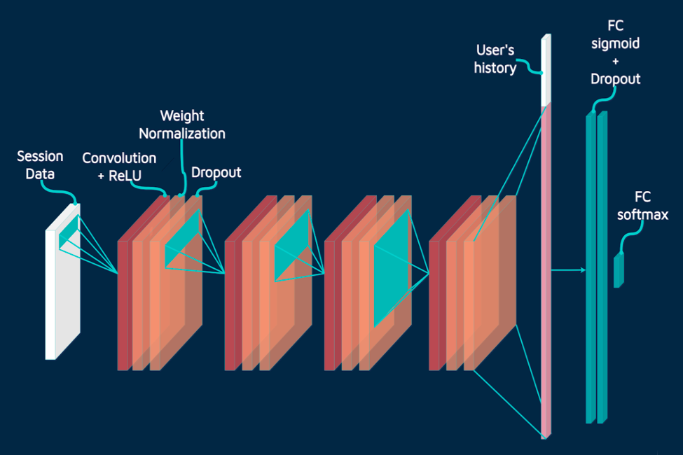
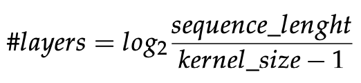

<h1 align="center">
Vodafone Data Science Hackathon 2021</h1>

  <a href="https://www.linkedin.com/in/eliatorre/">Elia Torre</a>,
  <a href="https://www.linkedin.com/in/edoardobotta/">Edoardo Botta</a>,
  <a href="https://www.linkedin.com/in/marco-antonioli/">Marco Antonioli</a>
  
<a href="https://bidsa.unibocconi.eu">Bocconi Institute for Data Science and Analytics</a>, Bocconi University, Milan, Italy

>**
 Abstract:** *This repository presents the research undertaken in the Vodafone Data Science Challenge (2021). The purpose of the challenge was that of predicting the nature of the Vodafone customers interactions with Tobi Digital Assistant to enhance Vodafone Customer Service. The research was based on a dataset of supervised interactions parameters used to classify customers communications with Tobi. Leveraging Convolutional Neural Networks (CNN) along with some inspiration taken from sequence classification models and deep recommender systems, we designed a model to take two inputs, one representing the user history on past interactions and one composed by the sessions events in order to draw conclusions on the nature of the interactions.*

## 🚀 Winning Team of Vodafone Data Science Hackathon 2021 
Our team (Elia Torre, Edoardo Botta & Marco Antonioli) outperformed 40 competing teams in the **Vodafone Data Science Hackathon 2021** exploiting a Temporal-Convolutional Neural Network. Here below, a figure describing our architecture. 

## Dataset & Pre-Processing
The dataset presents the events leading to the interaction with Tobi. Each row in the dataframe describes one such event through:
1. Session Identifier
2. Customer Identifier
3. Event Timestamp
4. Event Descriptor (Up to 4 Hierarchical Properties)
5. Tobi Session Timestamp
6. Tobi Session Label

The Pandas Timestamps were not exploitable as such. So, we re-formatted them to achieve a positive-series of time identifiers starting from a prior baseline date. Each event presents an hierarchical categorization *"X_Y"* with *X* as the category (1 to 4), while *Y* provides a deeper characterization of the events. We decided to drop this notation in favor of an implicit characterization of *X* associated with the column label. However, we preserved *Y* in explicit form. We addressed missing events in the dataset (indicated with "None") converting them to *-1*. The rationale behind this choice is that *-1* is not a significant value among those of the columns and hence it does not mislead the training of our model.

After the process of data cleaning, we deeper thought about the relations among the variables. We decided to perform a reshaping on the dataset. The rationale is that we interpreted the sessions as sequences of events. Indeed, we decided to give the dataframe a three dimensional structure. The three matrix-dimensions:
1. Number of Sessions
2. Maximum Number of Events in a Session
3. Features of the Events

We proceeded in splitting the dataframe in training, test and validation samples. In addition, we scaled the features, in order to achieve a zero mean distribution with unit variance. This structure is then given to the neural network as a first input.

## Model & Training
Since we interpreted the sessions as sequences of events, we decided to use a **Temporal Convolutional Network (TCN)**, in order to extract time dependencies. We decided to adopt a kernel size of 3 and 128 filters, moreover we applied exponential growing dilation rate. In this structure the number of layers is equal to:

Information from 3-D input are captured by four convolutional layers and the output of this convolutional block is then flattened to obtaine a vector representing the unique sessions. This vector is then concatenated with a second input composed by the frequencies of each label in users’ past interactions as an history log. The concatenated vector is passed as input in a sequence of three fully connected layers, with the last one being a four neurons output layer with "softmax" activation. In order to improve training performances and avoid eventual overfitting we applied *Weight-normalization* to every convolutional layer and *dropout* to both convolutional and fully connected layers. Moreover, an important remark about the training process is that, when building the input structure we made sure that no information about the label of the session currently being passed was used as a feature. Indeed, the current session is never already part of the user history.

## Results
Our model evaluated a 52% accuracy, coming from a 63% accuracy on returning users and a 48% accuracy in cold-start. A remark on the overall accuracy is that the implementation of the history log allowed us to notably increase the precision in the returning users, resulting in an overall higher precision.

